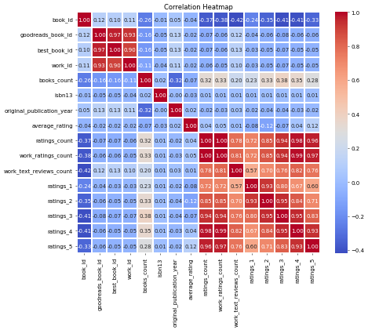
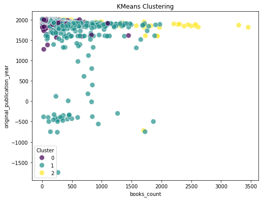
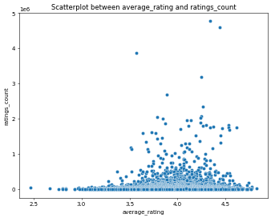

# Image Narratives

## correlation_heatmap

### Analysis of Book Data Trends

In the analysis of the book dataset, various attributes were examined for relationships and correlations that provide insights into reader preferences and book characteristics. The data includes several key fields such as book identifiers, author information, publication year, title, language codes, and several ratings-related metrics.

#### Key Attributes and Their Importance

1. **Identifiers**:
   - Attributes such as `book_id`, `goodreads_book_id`, and `best_book_id` serve mainly as unique identifiers for the books in the database. These are critical for organizing and retrieving information efficiently.

2. **Books Count and Publication Year**:
   - The `books_count` indicates the number of books an author has written. Correlation analysis shows a relatively weak association with `original_publication_year`, suggesting that the number of works does not significantly impact when a book was published. This outcome might indicate that prolific authors produce books across various years without a steady pattern.

3. **Ratings Metrics**:
   - The average rating (`average_rating`) appears to be significantly influenced by the distribution of ratings, particularly `ratings_4` and `ratings_5`. A strong positive correlation between these two metrics highlights that high ratings contribute significantly to a book's overall score. Conversely, ratings of lower values (`ratings_1`, `ratings_2`) have a negative correlation with average ratings, indicating that fewer readers rated the books poorly.

4. **Reader Engagement**:
   - Attributes like `ratings_count` and `work_ratings_count` measure reader engagement, revealing how many individuals rated a book and how actively the book has been reviewed. The `ratings_count` shows a robust correlation with `work_ratings_count`, suggesting that books with higher overall reader engagement often see a comparable volume of ratings and reviews. This trend could imply that more popular titles naturally garner more attention and feedback.

5. **Text Reviews**:
   - The `work_text_reviews_count` field highlights the number of written reviews, which are often more revealing than numeric ratings. There seems to be a moderate correlation between the number of numeric ratings and text reviews, suggesting that books receiving more ratings also attract more detailed feedback, thereby providing richer insights into reader perspectives.

#### Insights from Correlation Analysis

The correlation heatmap reveals several noteworthy patterns:

- **Strong Associations**:
  - The relationship between high numeric ratings (especially `ratings_4` and `ratings_5`) and the average rating is significant, establishing that higher volume of positive feedback directly relates to better average scores.
  
- **Negative Trends**: 
  - There is a notable negative correlation between the number of lower ratings (e.g., `ratings_1`) and the average rating. This indicates that books with a portion of dissatisfied readers tend to show a diminished overall score, reflecting the impact of critical feedback.

- **Author Impact**:
  - While the number of books an author has written does not have a strong correlation with average ratings, it could still influence reader perception — seasoned authors with multiple titles might have garnered loyalty, affecting how new works are evaluated.

### Conclusion

The analysis of this book dataset provides a multi-faceted view into the factors influencing book ratings and reader interactions. It emphasizes the importance of positive feedback and highlights the interplay between reader engagement and the perceived quality of literary works. Understanding these patterns can guide authors, publishers, and marketers in making informed decisions to enhance visibility and reception in a competitive literary landscape.

## clustering_plot

# Analysis of Book Data Clustering

## Introduction
The dataset under review encompasses various attributes of books, including their publication years, the number of copies, and reader ratings. Using KMeans clustering, we can derive insights into the distribution and characteristics of these books in the provided dimensions.

## Data Structure
The dataset comprises attributes that reflect the properties of books as follows:

- **Book Identification**: Unique identifiers across different platforms.
- **Publication Year**: A pivotal factor in determining a book’s relevance and readership over time.
- **Book Count**: Indicates the number of editions or copies available, which can influence popularity.
- **Authors**: The creators of the works, whose styles and genres greatly affect ratings.
- **Ratings**: Measures the community's response, categorized from one to five stars.

### Key Attributes
- **Original Publication Year**: The x-axis in our analysis, this attribute signifies the chronological order of publication. It gives context to trends in literature and reader engagement over the years.
- **Books Count**: The y-axis, denoting how many editions exist for each title, provides insights into how extensively a book has been circulated or republished.

## Clustering Insights
The KMeans clustering technique classified the data into three main clusters, reflecting distinct patterns among the books:

### Cluster Analysis
- **Cluster 0 (Purple)**: Books in this cluster generally have lower publication years but a substantial number of editions, indicating a blend of classic literature that continues to have appeal. These titles may have stood the test of time, maintaining their relevance in contemporary discussions, possibly due to educational curriculums or cultural significance.

- **Cluster 1 (Teal)**: This group features a mix of older and more recent titles. The spread suggests these books are frequently rediscovered, perhaps due to evolving reader interests or recent adaptations in various media. The higher books count in this cluster indicates a mix of established and emerging authors who are beginning to build their readership.

- **Cluster 2 (Yellow)**: Characterized by relatively newer publications with fewer editions. This could reflect emerging trends or genres gaining traction in the modern literary scene. The emphasis on recent works points to a dynamic publishing environment where new voices are rapidly gaining attention.

## Trends and Observations
The analysis highlights intriguing trends in the publishing landscape:

1. **Longevity of Classics**: Classic titles persist in readership studies, suggesting that foundational literature continues to be valued.
  
2. **Emergence of New Authors**: The growing cluster of newer publications indicates a vibrant author community eager to explore diverse narratives and styles. This cluster represents the future of literature, where fresh ideas are welcomed.

3. **Reader Engagement**: The ratings distribution is pivotal in understanding reader preferences. A trend of high ratings for recent publications indicates an enthusiastic reception for new works, while classics maintain moderate ratings, possibly reflecting entrenched views.

## Conclusion
The clustering analysis provides a multifaceted view of the book dataset, revealing how publication year and the number of editions correlate with reader engagement. The identification of distinct clusters aids in understanding trends in literature, suggesting an interplay between the past and the present as the literary landscape evolves. Future studies could enhance this analysis by incorporating more granular data on reader demographics and genre preferences, driving deeper insights into reading habits.

## average_rating_ratings_count_scatterplot

### Analysis of Book Ratings and Popularity

In the vast landscape of literature, understanding readers' preferences and the popularity of books is crucial for authors, publishers, and literary enthusiasts alike. By examining the relationship between average ratings and the number of ratings for various titles, intriguing trends emerge that reveal valuable insights into what makes a book resonate with audiences.

#### Overview of the Data Structure

The dataset comprises several important fields that collectively provide a comprehensive view of each book. Key attributes include:

- **Identifiers:** Unique IDs such as `book_id`, `goodreads_book_id`, `best_book_id`, and `work_id` allow for precise tracking and reference across platforms.
- **Book Attributes:** Information like `title`, `authors`, `original_publication_year`, and `original_title` enriches the context of each book, linking readers to the literary work and its creator.
- **Publication Details:** The `isbn` and `isbn13` fields serve as standard identifiers for the publication, facilitating accessibility and searchability.
- **Ratings Information:** Fields such as `average_rating`, `ratings_count`, and breakdowns of ratings (1 through 5 stars) provide insights into the reception of each book. The number of ratings a book accumulates often serves as a proxy for its popularity.

#### Trends in Ratings and Popularity

The scatterplot serves as a valuable visualization tool, depicting the relationship between average ratings and ratings count. A closer examination of the data reveals a mix of trends:

1. **Positive Correlation**: There is a notable trend that higher average ratings tend to correlate with a greater number of ratings. This could suggest that as books receive more acclaim, they also attract more readers. Such titles might be bestsellers or critically acclaimed works.

2. **Distribution of Ratings**: The breakdown of ratings showcases how audiences perceive different works. Books with an average rating above 4 tend to have higher ratings counts, indicating established popularity among readers. Conversely, those with low ratings may reflect polarizing opinions, resulting in fewer ratings overall.

3. **Outliers in Popularity**: A handful of titles stand out as outliers, holding exceptionally high ratings despite a relatively modest number of ratings. These can indicate niche markets where specialized genres or specific themes resonate deeply with a small but dedicated audience.

4. **Books with Mixed Reviews**: Titles exhibiting a broad range of ratings (many 1s and 5s) suggest a divided audience. This divergence might reflect stylistic choices or content that appeals intensely to certain readers while alienating others.

#### Conclusion

Analyzing the interplay between average ratings and ratings count reveals key insights into reader behavior and book popularity. Books that achieve high average ratings while also garnering numerous ratings represent a successful blend of quality and visibility. Understanding these dynamics enables authors and publishers to better navigate the literary landscape, respond to audience preferences, and ultimately foster more meaningful connections with readers. As the literary world evolves, ongoing analysis of such data will remain integral to recognizing emerging trends and shifts in reader sentiment.

