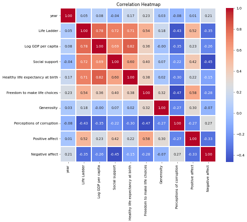
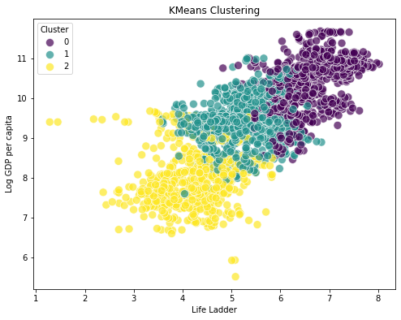
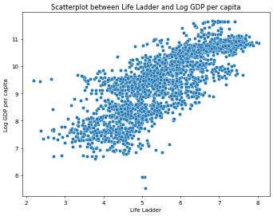

# Image Narratives

## correlation_heatmap

### Exploring the Correlation Between Happiness Factors

In an age where quality of life is paramount, understanding the nuances behind happiness and well-being across different countries has garnered considerable attention. This analysis delves into the interconnectedness of various factors that contribute to a nation's overall happiness, as indicated by the 'Life Ladder', which serves as a composite measure of subjective well-being.

### The Life Ladder and Its Correlates

The 'Life Ladder' score stands central in this investigation, showing a positive correlation with several factors. Notably, it aligns strongly with 'Log GDP per capita' (0.78), suggesting that economic performance, reflected in income levels, significantly impacts residents' perceived quality of life. This correlation, while robust, also underscores that the relationship between wealth and well-being is multifaceted, often influenced by additional social indicators.

### Social Support and Healthy Life Expectancy

Parallel to economic measures, 'Social support' (0.73) and 'Healthy life expectancy at birth' (0.71) also bolster life satisfaction. Countries fostering robust social safety nets and community support systems tend to exhibit higher happiness ratings. Similarly, healthier populations, benefitting from extended life expectancy, correlate with elevated life satisfaction. This points to a vital synergy between health and social dynamics in crafting a happier society.

### Freedom, Generosity, and Corruption Perception

Freedom to make life choices emerges as another significant contributor, showing a correlation of 0.62 with the 'Life Ladder'. Individuals empowered to make choices regarding their life paths tend to report higher satisfaction. In contrast, perceived corruption reflects a negative association (−0.50), indicating that trust in governance and institutions critically affects societal happiness. Countries perceived to be more corrupt dilute citizens' optimism, impairing their overall sense of well-being.

Generosity presents a more nuanced picture, reflecting a weak positive correlation (0.23) with life satisfaction. This may suggest that while charitable behaviors enhance community bonds, their impact on individual happiness can be overshadowed by pressing economic and personal factors.

### The Spectrum of Affect

Interestingly, emotional well-being, signaled by 'Positive affect' (0.57) and 'Negative affect' (−0.26), adds another dimension to the analysis. Positive emotional states correlate strongly with a higher 'Life Ladder', while negative feelings detract from overall happiness. This implies that fostering positive experiences and minimizing negative ones is crucial for enhancing life satisfaction.

### Conclusion: A Complex Interplay 

The interrelations highlighted in this analysis paint a complex picture of happiness determinants across countries. Economic wealth, robust social frameworks, health consciousness, individual freedoms, and emotional well-being emerge as vital components. While the importance of GDP and material wealth is evident, the subtle influences of social dynamics, health, and governance perceptions are equally critical in shaping citizens' overall happiness. As nations strive to improve their citizens' well-being, understanding this intricate web becomes essential for effective policy-making and societal growth.

## clustering_plot

# Exploration of Global Well-Being and Economic Factors

In a world rich with diversity, understanding the interconnectedness of various factors influencing human well-being offers vital insights into societal progress. By analyzing metrics such as the Life Ladder, GDP per capita, social support, and perceptions of corruption, we can discern the intricate patterns affecting people's lives across different nations.

## Life Ladder and Economic Correlates

The Life Ladder serves as an essential indicator of subjective well-being, reflecting the general life satisfaction of individuals. A striking relationship emerges when comparing it with the Log GDP per capita, suggesting a positive correlation between economic prosperity and happiness levels. As nations ascend the economic ladder, they typically witness improvements in citizens' overall life satisfaction. The clustering analysis illustrates this trend effectively, where groups of countries are categorized based on their economic status and corresponding well-being. The clustering indicates three distinct sets of nations, each representing different landscapes of prosperity and happiness.

## Clusters of Well-Being

In the analysis, countries within the first cluster demonstrate a marked elevation on both the Life Ladder and GDP per capita scales. These nations benefit from robust economies, offering substantial social support and enabling high levels of freedom for personal choices. The happiness of their citizens is also reflected in positive affect scores, which indicate an overall sense of optimism and contentment. 

Conversely, the second cluster consists of nations with moderate economic performance and life satisfaction. While these countries enjoy some degree of social support and healthy life expectancy, they often grapple with challenges such as varied perceptions of corruption and lesser generational wealth distribution. Health metrics play a vital role here; countries within this group may provide adequate health care services but still lag in delivering the quality of life seen in higher clusters.

Finally, the third cluster presents a more concerning picture. Nations in this category typically exhibit lower GDP per capita and life satisfaction. Issues around freedom and perceptions of corruption prominently surface here, influencing citizens’ trust in institutions and their overall contentment. These countries often fight against systemic challenges, evidenced by dwindling social support and low positive affect.

## The Role of Social Support and Health

Social support emerges as a crucial element in overall happiness and well-being. Countries that place a strong emphasis on community and social networks tend to foster environments where individuals feel secure and valued. This is palpably felt in the highest cluster, where social cohesiveness aligns closely with life satisfaction metrics. In contrast, nations with weaker social support systems struggle to nurture the same levels of happiness among their populations.

Healthy life expectancy at birth also factors significantly into our understanding of well-being. Countries that prioritize public health typically witness longer, happier lives, further enhancing the happiness indicators associated with economic prosperity. The relationship between health metrics and satisfaction highlights the necessity of investing in health infrastructure as a means to elevate both GDP and life satisfaction.

## Perceptions of Corruption and Generosity

Perceptions of corruption present another layer of complexity in assessing societal happiness. Nations where citizens perceive low levels of corruption tend to enjoy higher life satisfaction scores. The ability to trust the integrity of institutions directly impacts the freedom to make life choices, correlating with the overall happiness of individuals. 

Moreover, the generosity metric sheds light on how cultural aspects influence happiness. In countries where altruistic behaviors are commonplace, residents often report higher satisfaction levels. The collective mindset fosters a sense of community and care that enriches the individual experience.

## Conclusion

The patterns and clusters derived from the analysis delineate a clear narrative: the interconnectedness of economic stability, social support, health, and governance plays a pivotal role in shaping human well-being globally. The insights provided by these metrics reveal that while economic prosperity is fundamental, it is the holistic integration of social wellbeing, health, and ethical governance that truly fosters a contented society. As nations strive for improvement, focusing on these intertwined elements will be essential for enhancing the quality of life for current and future generations.

## LifeLadder_LogGDPpercapita_scatterplot

### Exploring National Well-being Through Economic and Social Metrics

In recent analyses of global well-being, multifaceted indicators have been utilized to gauge the quality of life across various nations. Among these metrics, the Life Ladder and Log GDP per capita stand out as key variables, reflecting both subjective well-being and economic prosperity.

### Life Ladder and Economic Affluence

The Life Ladder, a subjective measure of life satisfaction, is correlated with a nation's Log GDP per capita. A scatterplot depicting this relationship reveals a strong positive correlation. As the Life Ladder score increases, indicating higher levels of subjective happiness, there is also a corresponding rise in Log GDP per capita. This trend suggests that individuals in affluent countries tend to perceive their lives more positively, likely due to better access to resources, healthcare, and overall opportunities.

### Insights from the Data Distribution

The distribution of data points indicates a compact cluster between the values of 4 and 6 on the Life Ladder. This area represents a significant portion of the global population, hinting at a common experience of moderate life satisfaction across various countries. However, there are notable outliers. Certain nations with low GDP per capita present surprisingly high Life Ladder scores, challenging the assumption that economic wealth is the sole determinant of well-being. This anomaly could be attributed to robust social networks, cultural factors, or resilient community bonds that enhance life satisfaction despite financial limitations.

### The Role of Social Support and Other Factors

In addition to economic factors, Social Support emerges as a crucial variable influencing life satisfaction. Countries with strong communal ties and social safety nets tend to report higher Life Ladder scores, pointing to the importance of interpersonal relationships and societal stability. This consideration underscores the complexity of well-being, suggesting that economic measures alone cannot entirely encapsulate a nation's quality of life.

### Exploring Freedom and Perceptions

Further analysis reveals that the Freedom to make life choices significantly impacts happiness levels. Countries that prioritize individual freedoms and support personal agency typically demonstrate higher life satisfaction scores. Conversely, nations where corruption is perceived as rampant tend to experience lower Life Ladder rankings, highlighting how governance and societal norms shape public sentiment.

### Emotional Well-being Dimensions

The positive and negative affect metrics provide additional depth to the analysis. Countries that excel in positive affect, or the experience of positive emotions, also tend to score well on the Life Ladder. Conversely, high levels of negative affect correspond with diminished life satisfaction. 

### Conclusion

The exploration of these metrics illustrates that life satisfaction is not solely determined by economic factors. While Log GDP per capita is a significant predictor, social factors, individual freedoms, and emotional well-being intricately weave together to create the tapestry of national well-being. As nations strive for progress, recognizing the interplay of these diverse elements is vital for fostering holistic improvement in quality of life. In conclusion, the quest for happiness transcends mere economic prosperity, calling for a balanced approach that prioritizes social equity, personal freedom, and community support.

