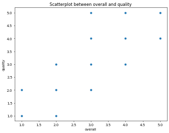
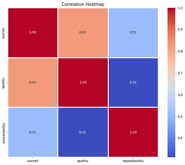
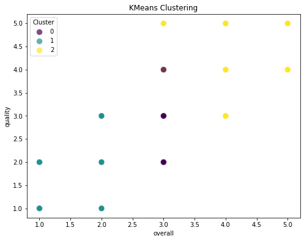

# Image Narratives

## overall_quality_scatterplot

## Analyzing Trends in Overall Performance and Quality

In the realm of assessment and evaluation, the relationship between overall performance and quality provides critical insights into the effectiveness of various subjects. This narrative explores the interplay between these two metrics, shedding light on patterns that emerge and their implications for future assessments.

### Understanding the Data Structure

The collected data comprises various entries, each characterized by specific metrics including overall performance and quality ratings. The overall score encapsulates a general perception of effectiveness, while the quality score delves into the specifics of execution and delivery. By plotting these two variables against each other, we create a visual representation of their correlation, revealing significant insights.

### Observing the Scatterplot

The scatterplot presents a diverse array of points, symbolizing individual entries with varying ratings for overall performance and quality. Each point on this plot tells a story; some achieve high scores in both metrics, while others demonstrate discrepancies between overall perception and quality of execution.

### Key Trends Identified

1. **Positive Correlation**:
   A noticeable trend is the positive correlation between overall performance and quality. Higher overall scores often align with elevated quality ratings. This suggests that those who are perceived as effective also tend to deliver high-quality outcomes, reinforcing the notion that perception and execution go hand in hand.

2. **Outliers**:
   Within the data, outliers can be identified where overall ratings are low while quality remains relatively high, or vice versa. Such cases warrant further investigation; they may indicate discrepancies in subjective perception versus actual performance. Understanding these outliers could lead to nuanced insights about the effectiveness of performances that may not fit the general trend.

3. **Density in Ratings**:
   The scatterplot reveals clusters of points, particularly around the mid-range of both metrics. This indicates a concentration of entries achieving moderate overall performance and quality scores. Such a distribution suggests a potential need for enhancements in specific areas, as many entries are not reaching high standards in either metric.

### Implications for Future Assessments

The interplay between the overall and quality scores emphasizes the importance of not only aiming for high overall ratings but also ensuring that quality does not lag. To improve outcomes:

- **Focus on Quality Development**: Institutions and evaluators should prioritize quality enhancement initiatives alongside efforts to boost overall performance. Resources allocated towards training or workshops could yield significant improvements.
  
- **Reassess Evaluation Criteria**: Understanding why certain entries are rated high in one metric and low in another could inform better assessment criteria that recognize and reward comprehensive excellence.

### Conclusion

The analysis of the relationship between overall performance and quality illuminates essential trends that can guide future evaluations. By recognizing the positive correlation, acknowledging outliers, and understanding common ratings, organizations can tailor their approaches to foster improvements that ensure not just perceived effectiveness but actual quality in execution. The journey toward excellence is continual, and insights drawn from this analysis pave the way for more informed decisions in future assessments.

## correlation_heatmap

# Analyzing Correlation in Data Metrics

Understanding the relationships between different metrics is crucial for assessing performance and guiding future improvements. In this analysis, we delve into three primary dimensions: overall performance, quality, and repeatability. The correlation between these metrics reveals significant insights into their interdependencies and overall trends.

## Overall Performance

The “overall” metric stands as the cornerstone of the analysis, representing the comprehensive assessment of the dataset in question. It correlates strongly with the “quality” metric, showcasing a robust relationship (correlation coefficient of 0.83). This indicates that as the quality of the input increases, the overall performance is likely to improve as well. Such a strong correlation suggests that focusing on enhancing quality could yield significant benefits for overall outcomes.

Conversely, the correlation with “repeatability” is notably lower at 0.51. This relationship suggests that while increased repeatability may contribute positively to overall performance, the effect is not as pronounced compared to that of quality. The moderate correlation indicates the necessity of stable processes to ensure consistent results, though perhaps not as critical as maintaining high-quality inputs.

## Quality

Delving deeper into the quality metric, it emerges as a pivotal factor influencing overall performance. With a strong correlation of 0.83 with overall results, it illustrates that improvements in quality metrics are likely to enhance the overall score significantly. Interestingly, the correlation between quality and repeatability is weaker, at 0.31. This implies that improvements in quality may not directly translate to increased repeatability, indicating that these aspects may be affected by different underlying factors.

The lower correlation between quality and repeatability suggests a complex interplay where the two metrics can be affected by various circumstances. It invites further investigation into the specific conditions that can enhance repeatability without necessarily impacting quality.

## Repeatability

The repeatability metric serves as a measure of consistency in the dataset. While its correlation with overall performance (0.51) is moderate, it again highlights that enhancing repeatability can contribute positively to overall results, albeit not as significantly as quality does. 

Its correlation with quality reinforces this point, showcasing the complexities involved. With a 0.31 correlation, it suggests that repeatability and quality may function in somewhat parallel paths, rather than being directly tied to each other. This finding signals a potential area for process improvement where efforts can be targeted to enhance repeatability without compromising quality.

## Conclusion

The analysis of these three metrics—overall performance, quality, and repeatability—reveals critical insights into their interrelationships. The strong correlation between overall performance and quality suggests that future initiatives should prioritize quality enhancements to drive better results. However, the roles of repeatability cannot be underestimated, as it contributes to the stability and reliability of outcomes.

Understanding these correlations equips stakeholders with actionable insights that can guide strategic decisions aimed at optimizing overall performance. Continued examination of these dynamics will further illuminate the pathways to achieving higher standards and more consistent outputs.

## clustering_plot

### Analyzing Quality Trends in Clustering Data

In an effort to understand the relationship between overall ratings and perceived quality, a clustering analysis was conducted. The objective was to categorize the data into distinct groups based on these two dimensions—overall scores and their corresponding quality ratings—using KMeans clustering.

### Clustering Overview

The clustering process revealed three distinct clusters, each represented by different colors in the analysis. The first cluster is denoted by teal, the second by purple, and the third by yellow. Each cluster encompasses data points that share similar characteristics, allowing for deeper insight into how overall ratings correlate with quality perceptions.

### Insights from Cluster 0 (Teal)

The first cluster, marked in teal, consists of data points that exhibit lower overall scores, primarily falling within the range of 1 to 2. Correspondingly, this cluster also shows quality ratings that align closely with these lower scores, predominantly at the lower end of the quality scale—around 1.5 to 2.5. This suggests that items in this category often receive poor evaluations across both dimensions, indicating a possible area that requires attention or improvement. 

### Insights from Cluster 1 (Purple)

The second cluster, represented in purple, occupies a middle ground. Here, the overall scores are slightly higher, ranging from 2.5 to 3.5, reflecting a moderate perception of both quality and overall satisfaction. This distribution indicates that while some elements may still underperform, there are noteworthy instances in this cluster that demonstrate potential for enhancement. The quality ratings in this range show variability but generally remain above the lowest thresholds. 

### Insights from Cluster 2 (Yellow)

Lastly, the third cluster, categorized in yellow, showcases impressive overall scores concentrated between 4 and 5, with corresponding quality ratings that are also high, averaging around 4.5. This cluster represents the upper echelon of quality perception, indicating satisfaction and strong approval among these data points. The density of points in this area suggests that certain high-performing elements have successfully fulfilled or exceeded expectations. 

### Overall Trends and Conclusions

The analysis reveals an interesting gradient between quality assessments and overall ratings. Lower clusters indicate challenges in quality perception, suggesting that products or items categorized here may involve issues that detract from user satisfaction. In contrast, the higher cluster reflects products that resonate well with consumers, showcasing effective implementation of quality standards.

This structured examination of clusters provides strategic insights that can be harnessed for improvement initiatives. Identifying and understanding the traits of lower-performing clusters can guide targeted interventions, fostering advancements in quality that could elevate overall ratings. Conversely, maintaining and enhancing the attributes of higher-performing clusters ensures that benchmarks for success remain strong.

Thus, the clustering analysis not only sheds light on the current standing of various items but also opens pathways for actionable steps aimed at elevating overall performance through targeted strategies in quality improvement.

